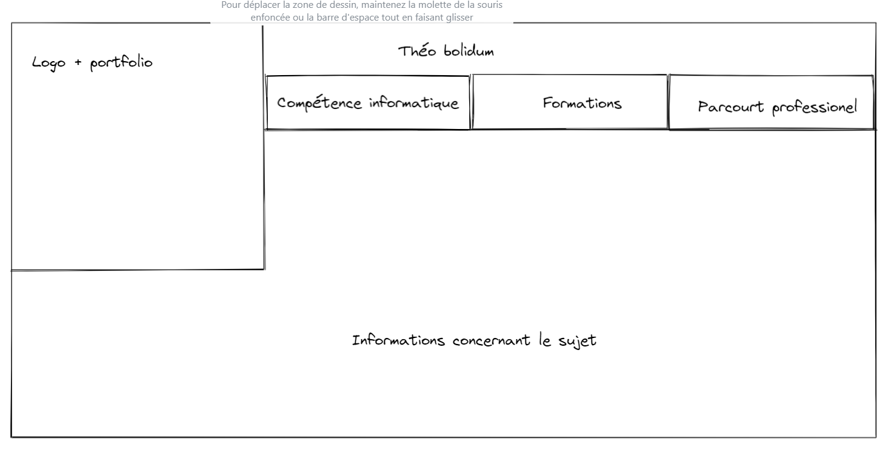

BOLIDUM Théo

**PORTFOLIO :  Charte graphique **

Tout d’abord, commençons par les couleurs que je souhaite utiliser. 

**Couleur 1** : 00FFF9

 **Couleur 2** : 00FF86

**Couleur 3** : F0F0F0
 

Ensuite, j'ai pensé à utiliser ce logo. Il faudrait que je change les couleurs afin d'adapter à mes couleurs du portfolio (Vert, turquoise, blanc)..

J'hésite entre plusieurs police, tout dépendra du rendu du site  

- Bounchy 
- Sticky book 

Enfin, le site sera constitué comme ceci  : 

De plus, le site aura un mode sombre, qui permettra aux yeux fatigués de se reposer ! 

